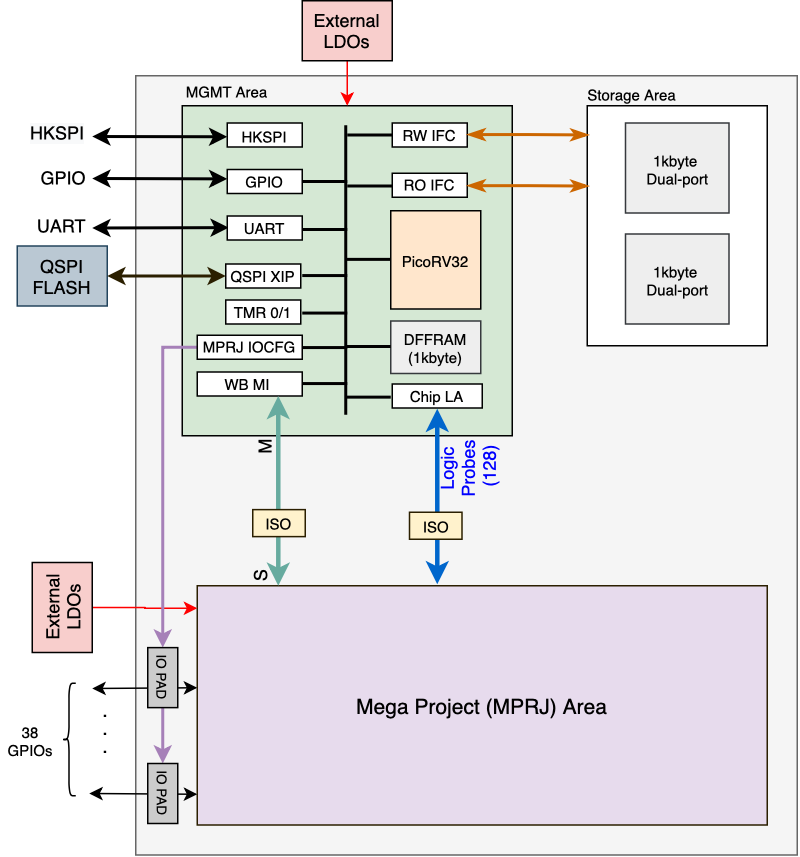

# PyFive

- The original goal of the PyFive project is to create a RISC-V based microcontroller with the ability to easily support CircuitPython.

- For the first shuttle, we are starting small and verifying the USB core. The USB core is accompanied by simple audio and video output cores to fill in more of the user area.

- Future plans are to create a full featured VexRiscV core with SRAMs once the OpenRAM support is released.

# CIIC Harness

- A template SoC for Google SKY130 free shuttles. It is still WIP. The current SoC architecture is given below.

    

## License

The theme is available as open source under the terms of the MIT License